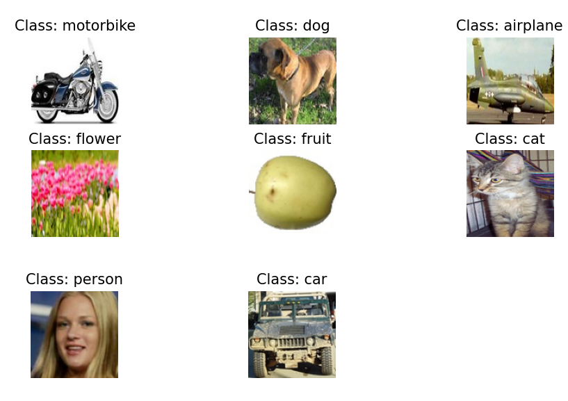
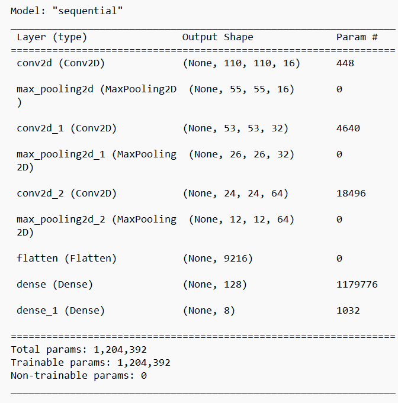
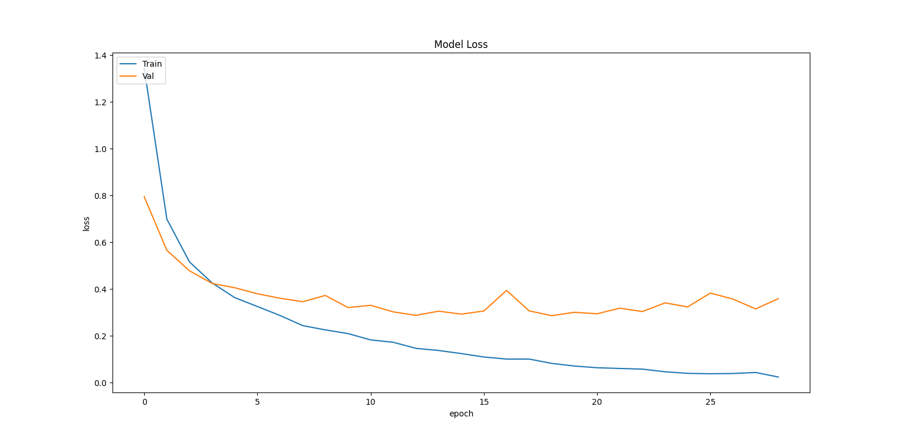
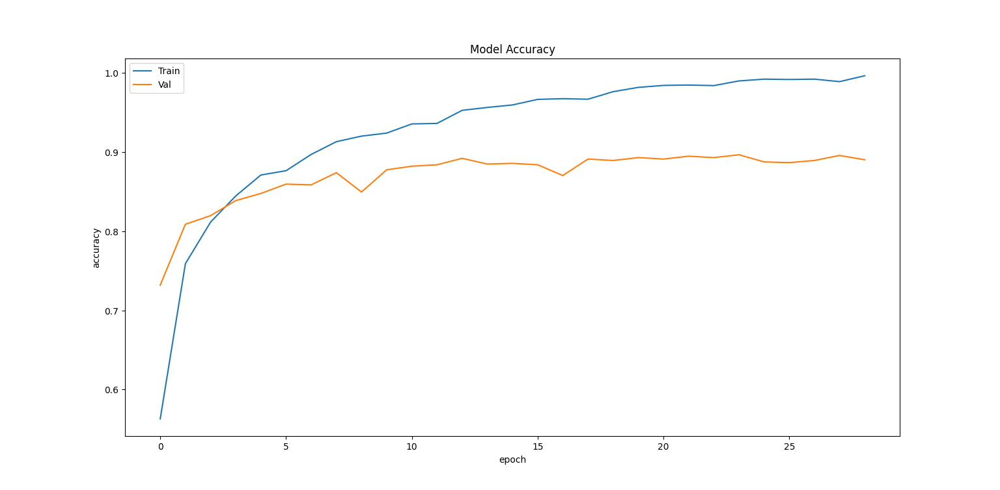
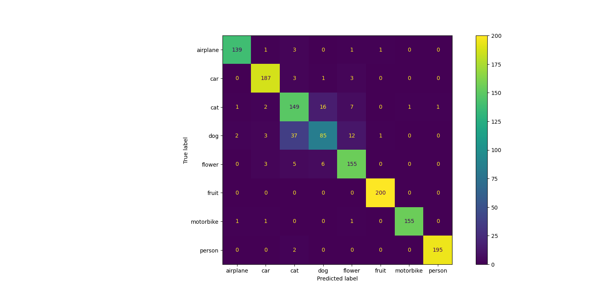

# CNN-Classification
CNN model to read, process, and classify images (i.e. 10 classes of animals)

| Class     | Image Count |
|-----------|-------------|
| car       | 968         |
| cat       | 885         |
| dog       | 702         |
| flower    | 843         |
| fruit     | 1000        |
| motorbike | 788         |
| person    | 986         |

<strong>Total Image Count:</strong>  6899

| Set Split    | Image Count |
|--------------|------|
| Training Set | 5519 |
| Testing Set  | 1380 |

#### Model Summary:

#### Model Evaluation:

| Metric      | Score  |
|-------------|--------|
| Accuracy    | %91.67 |
| F1 Score    | %91.51 |
| Sensitivity | %91.67 |
| Specificity | %98.84 |

#### Load Model:

    from tensorflow.keras.models import load_model
    loaded_model = load_model('natural_images_model_91.h5')

#### Predict:
    def preprocess_img(image_path, image_size):
        img = Image.open(image_path).convert('RGB').resize(image_size, Image.ANTIALIAS)
        image_arr = np.array(img) / 255.0
        return image_arr
    arr_im = preprocess_img(path_, image_size)
    pred_ = x = np.expand_dims(arr_im, axis=0)
    loaded_model.predict(pred_)

#### Reference:
* Dataset: [Natural Images](https://www.kaggle.com/datasets/prasunroy/natural-images)
* Split: [Split Tool](https://github.com/jfilter/split-folders)
